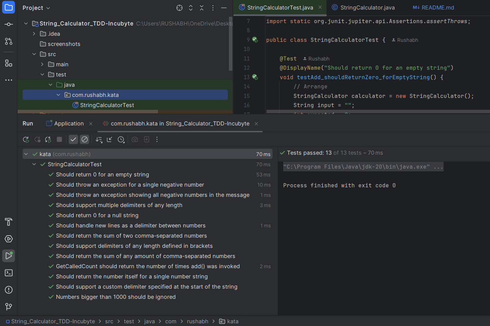
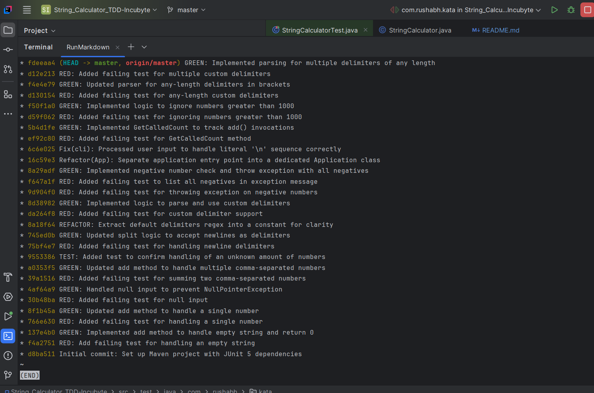

# String Calculator TDD Kata

This project is a solution to the String Calculator TDD Kata, implemented in Java using Maven and JUnit 5. The primary goal was to follow a strict Test-Driven Development (TDD) process, with frequent, atomic commits that clearly show the Red-Green-Refactor cycle.

The `StringCalculator` class supports a rich set of features, each added through a rigorous TDD cycle:

-   **Basic Handling**: Gracefully handles `null` and empty string inputs by returning `0`.
-   **Standard Delimiters**: Parses numbers separated by commas (`,`) and newlines (`\n`).
-   **Negative Number Validation**: Throws an `IllegalArgumentException` if negative numbers are provided, listing all negatives in the message.
-   **Large Number Filtering**: Numbers greater than 1000 are ignored in the sum.
-   **Invocation Tracking**: A `GetCalledCount()` method returns the total number of times `add()` has been invoked.

### Advanced Delimiter Support

-   **Simple Custom Delimiter**: Supports a single custom delimiter (e.g., `//;\n1;2`).
-   **Any-Length Delimiters**: Supports custom delimiters of any length, enclosed in brackets (e.g., `//[***]\n1***2***3`).
-   **Multiple Delimiters**: Supports multiple custom delimiters, each enclosed in its own set of brackets (e.g., `//[*][%]\n1*2%3`).
-   **Multiple Long Delimiters**: Correctly handles multiple delimiters that are longer than one character (e.g., `//[**][%%]\n1**2%%3`).

## How to Run the Project

This project is configured as a standard Maven project and is best run using an IDE like IntelliJ IDEA or Eclipse.

### 1. Running the Application (Interactive Mode)

1.  Clone the repository and open it as a project in IntelliJ IDEA.
2.  Navigate to the `src/main/java/com/rushabh/kata/Application.java` file.
3.  Right-click anywhere inside the `Application.java` editor window.
4.  Select **"Run 'Application.main()'"**.

An interactive console will start, prompting you for input.

### 2. Running the Unit Tests

1.  In the IntelliJ Project view, right-click on the `src/test/java` directory.
2.  Select **"Run All Tests"**.
3.  IntelliJ will run all the unit tests and display the results in the "Run" panel, showing a green bar to indicate that all tests have passed.

## Screenshots

**All Unit Tests Passing in IntelliJ:**

**Clean and Intentional Git Commit History:**

